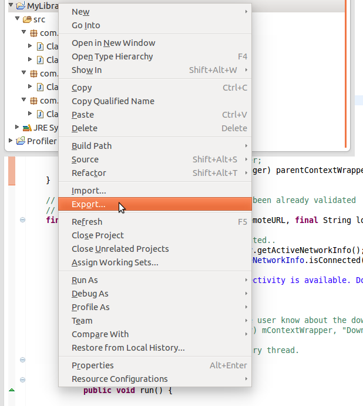
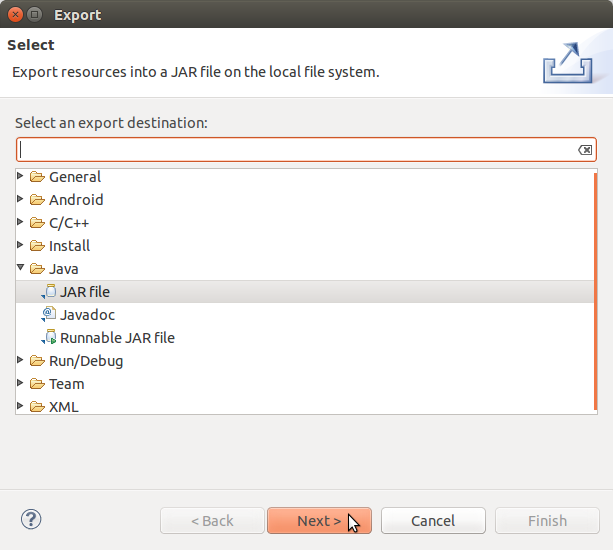

Complementary topics
====================

In the end of this documentation a couple of not so trivial use cases of *Grab'n Run* are presented. This section will not introduce new core concepts but it may help the developer to handle some **tricky situations**. For such a reason feel free to **skip this part** and eventually **come back later** to revise it whenever you will encounter one of the following situations while using the library.

Handle containers whose classes come from different package names which have a common relevant prefix
-----------------------------------------------------------------------------------------------------

Before starting diving in this section it is important to recall the **relationship between package name and containers**. 

**Package name in apk containers**
	*Apk* containers must contain just **one package name**, which must be chosen by the developer when a new application is created. The package name is then stored in the *Android Manifest* of the application. In order to have an application being admitted on the *Google Play* store, it is also fundamental that the chosen package name is **unique** and should **not change** for the whole life cycle of the application.

**Package name in jar containers**
	*Jar* containers on the other hand do **not** have such a **strict policy** as in *apk* containers. Hypothetically each class file contained in a *jar* archive may have a different package name and this mean that **many package names** can be present in the **same** *jar* container.

**Common relevant prefix**
	In *Grab'n Run* two package names share a relevant common prefix if their prefix match for at least two words separated by one dot.
	
	**Example:**
	Consider the following package names: 

	A. ``com.example.polimi``
	B. ``it.example.polimi``
	C. ``com.test``
	D. ``com.example.application.system``
	E. ``com.example.polimi.system``

	* A. and B. do **not** share any **common relevant prefix** since they differ in the initial word of the package name (``com`` vs ``it``).
	* A. and C. do **not** share any **common relevant prefix** since they just have one word of the package name in common (``com``).
	* A. and D. share a **common relevant prefix** (``com.example``).
	* A. and E. share a **common relevant prefix** (``com.example.polimi``).

Given these insights a first interesting situation to consider is when a developer wants to *load dynamically classes* from an external *jar* library which contains **more than one package name** that, anyway, share a **common relevant prefix**. Let us assume for example that the target library has the following structure:

.. image:: images/JarContStructure.png

In such a scenario we have four classes (``ClassA``, ``ClassB``, ``ClassC``, ``ClassD``) which belongs to **three different packages**, whose names are respectively ``com.example``, ``com.example.system`` and ``com.example.system.preference``. Let use also assume that this container has being signed with a *valid self-signed certificate*, remotely located at ``https://something.com/example_cert.pem``.

Questions now for the developer are:

1. *How should I fill in the associative map which links package names to remote certificate location in order to being able to load all the classes in this container?*
2. *Am I obliged to insert all three package names pointing to the very same certificate?*

Luckily the answer for the second question is **no**, which means that there is indeed an **easier way** to perform the job. *Grab'n Run* in fact was thought to make the whole dynamic class loading **secure but** at the same time **simple** for applications developers.

You can in fact handle this situation correctly by simply inserting into the associative map a **single entry** where the *key corresponds to the shortest among the package names* belonging to one of the classes that need to be loaded and the *value is the location of the remote certificate* used to sign the container. So in the **previous case** since the classes with the shortest package name are ``com.example.ClassA`` and  ``com.example.ClassB`` the following code is appropriate to populate the map::

		Map<String, URL> packageNamesToCertMap = new HashMap<String, URL>();

		try {
			packageNamesToCertMap.put(	"com.example", 
							new URL("https://something.com/example_cert.pem"));

		} catch (MalformedURLException e) {
			
			// The previous entry for the map may not necessarily be the right one 
			// but still it is not malformed so no exception should be raised.
			Log.e(TAG_MAIN, "A malformed URL was provided for a remote certificate location");
			
		}

For the rest the developer may proceed as shown in :ref:`Using SecureDexClassLoader to load dynamic code securely`. The result will be that the container is going to be verified against the appropriate certificate and, if it is **genuine**, it will be *also possible to load the other two classes* in the archive with a **different package name** (``com.example.system.ClassC`` and ``com.example.system.preference.ClassD``).

Handle containers whose classes come from different package names with no relevant common prefix
------------------------------------------------------------------------------------------------

Even if it is not such a common situation it is possible for a *jar* archive to *contain classes which belongs to different package names* and does not share any common relevant prefix.
This situation, on the other hand, is **not practical** for *apk* containers since, in order to be **published** on Google Market, 
an application needs to have a **single** package name which more over must **not change** during its whole life cycle.

Anyway let us try to sketch the case of the previous cited jar archive and how to handle it with ``SecureDexClassLoader``. As an example we can consider the 
scenario in which the goal is loading two classes, whose full class names are respectively ``com.example.MyFirstClass`` and ``com.test.MySecondClass`` and so 
which **differs** in the **package name** but are **both stored** in the **same container** ``exampleJar.jar``.
It is also supposed that this container has being signed with a *valid self-signed certificate*, remotely located at ``https://something.com/example_cert.pem``.

In order to handle this situation correctly the developer is required to fill the **associative map** which links package names and certificates
with **two entries**, one per each package name, which will *point to the same remote certificate*. This is exemplified in the following snippet of code::

		Map<String, URL> packageNamesToCertMap = new HashMap<String, URL>();

		try {
			packageNamesToCertMap.put(	"com.example",
							new URL("https://something.com/example_cert.pem"));
			packageNamesToCertMap.put(	"com.test",
							new URL("https://something.com/example_cert.pem"));

		} catch (MalformedURLException e) {
			
			// The previous entries for the map may not be necessarily the right ones 
			// but still they are not malformed so no exception should be raised.
			Log.e(TAG_MAIN, "A malformed URL was provided for a remote certificate location");
			
		}

For the rest the developer may proceed as shown in :ref:`Using SecureDexClassLoader to load dynamic code securely` and this procedure grants to succeed in the loading
process for any of the two classes independently on the order in which they are attempted to be loaded.

.. note::
	By design ``SecureDexClassLoader`` assumes that **each package name** is intrinsically related to a **single container**, while it is not necessary true the opposite.
	This means that attempting to *load a class*, whose **package name** is associated with **more than one container** provided in *dexPath* (i.e. each one of the two 
	containers contains at least one class with the same package name), will generate an **unpredictable behavior** since ``SecureDexClassLoader`` will associate 
	that package name with just one of the two containers.

	So it is a **developer responsibility** to check the containers in order to avoid the occurrence of this rare but undesirable situation.

.. _Reverse package name to obtain remote certificate URL:

Reverse package name to obtain remote certificate URL
-----------------------------------------------------

*Grab'n Run* provides as an extra feature the possibility to **reconstruct the remote URL location of the certificate by reversing the package name** provided into the associative map. To enable this feature simply add an entry to the associative map where the **key** is the **desired package name to reverse** and the **value** is ``null``.
Here is a simple snippet of code to exemplify::

		Map<String, URL> packageNamesToCertMap = new HashMap<String, URL>();

		// Notice that a null entry won't raise a MalformedURLException..
		packageNamesToCertMap.put("it.polimi.necst.mylibrary", null);

What is going on behind the curtains is that whenever GNR find an entry with *a valid package name associated to a null value*, it will **reverse the package name** with the following convention:

	The **first word** of the package name will be considered as the **top level domain (TLD)**, while the **second** one is going to be the **main domain**. Any **following word** of the package name will be used in the **same order** as they are listed to define the **file path** on the remote server and of course since a secure connection is needed for the certificate, **HTTPS protocol** will be enforced.

Let us translate this theory with some concrete examples:

* Package name ``it`` won't be reverted since it contains just a world (at least two are required for real world package name).
* Package name ``it.polimi`` will be reverted to the URL ``https://polimi.it/certificate.pem``.
* Package name ``it.polimi.necst.mylibrary`` will be reverted to the URL ``https://polimi.it/necst/mylibrary/certificate.pem``.

As you can see from the previous examples this naming convention assumes that the **final certificate** will be found in the *remote folder obtained by reverting the package name* and that the **certificate file** will have been **always renamed** ``certificate.pem``.

Perform dynamic code loading concurrently
-----------------------------------------

.. warning::
	Before approaching this paragraph, a good idea is having **first read** the :doc:`security` section of this documentation and in particular the last part on performance-related topics.

By default when a new ``SecureDexClassLoader`` object is instantiated, it will immediately **validate** all of its **containers concurrently** (**Eager signature verification strategy**). By the way sometimes when a large number of containers are assigned to a single ``SecureDexClassLoader`` object, it may just be *more convenient to evaluate each container separately just before loading classes from it*. So in such a scenario a **lazy signature verification strategy** would be advisable.

An even better *performance concern strategy* is loading target classes in a **concurrent** way on different threads. This is perfectly fine with *Grab'n Run* since the library is **thread-safe**.

As an example let us consider the case in which we want to *concurrently load some classes with a lazy strategy* from a ``SecureDexClassLoader`` instance with many containers associated to it. A possible code implementation which also makes use of `Executors <https://docs.oracle.com/javase/7/docs/api/java/util/concurrent/Executors.html>`_ , `FixedThreadPool <https://docs.oracle.com/javase/7/docs/api/java/util/concurrent/Executors.html#newFixedThreadPool(int)>`_ and `Future <https://docs.oracle.com/javase/7/docs/api/java/util/concurrent/Future.html>`_ classes is the following::  

	// Make the assumption that packageNamesToCertMap has been already initialized;
	// moreover longListOfDexPath is the String with all the containers path listed and
	// separated by :
	SecureLoaderFactory mSecureLoaderFactory = new SecureLoaderFactory(this);
	// Initialize a SecureDexClassLoader instance in LAZY mode.
	SecureDexClassLoader mSecureDexClassLoader = 
		mSecureLoaderFactory.createDexClassLoader(	longListOfDexPath, 
								null,
								getClass().getClassLoader(),
								packageNamesToCertMap, 
								true);

	// Suppose these classes belongs only to three different containers;
	// while longListOfDexPath points to ten containers..
	String[] classesToLoad = new String[] {	"com.example.classA",
						"it.polimi.classB",
						"de.application.classC",
						"com.example.classD",
						"it.polimi.classE"};

	// Suppose to store the loaded classes here..
	Set<Class<?>> loadedClassesSet = Collections.synchronizedSet(new HashSet<Class<?>>());

	// Initialize the thread pool executor with number of thread 
	// equals to the number of classes to load..
	ExecutorService threadLoadClassPool = Executors.newFixedThreadPool(classesToLoad.size());			
	List<Future<?>> futureTaskList = new ArrayList<Future<?>>();
			
	Iterator<String> classesToLoadIterator = classesToLoad.iterator();
			
	while (classesToLoadIterator.hasNext()) {
				
		String classNameToLoad = classesToLoadIterator.next();
			
		// Submit a new class load thread on a container and store 
		// a reference in the future objects list.
		Future<?> futureTask = 
			threadLoadClassPool.submit(new classLoadingTask(mSecureDexClassLoader, 
									classNameToLoad,
									loadedClassesSet));
		futureTaskList.add(futureTask);
	}
			
	// Stop accepting new tasks for the current threadLoadClassPool
	threadLoadClassPool.shutdown();
			
	for (Future<?> futureTask : futureTaskList) {
				
		try {
					
			// Wait till the current task for class loading is finished..
			futureTask.get();
					
		} catch (InterruptedException | ExecutionException e) {
					
			// Issue while executing the verification on a thread
			e.printStackTrace()
		}
	}
			
	try {
				
		// Join all the threads here.. Use a timeout eventually..
		threadLoadClassPool.awaitTermination(	KEEP_ALIVE_NUMBER_OF_TIME_UNITS,
							KEEP_ALIVE_TIME_UNIT);
	} catch (InterruptedException e) {
				
		// One or more of the threads objects were still busy..
		// And this should not happen..
		e.printStackTrace()
	}

And finally here it is the ``classLoadingTask``, an implementation of the `Runnable <https://docs.oracle.com/javase/7/docs/api/java/lang/Runnable.html>`_ interface, which is responsible for **dynamically loading** a single class with the previously created ``SecureDexClassLoader`` instance.  Here is the class implementation::

	class classLoadingTask implements Runnable {

		// The shared instance of SecureDexClassLoader for concurrent load ops.
		private SecureDexClassLoader mSecureDexClassLoader;
		// The name of the class to load.
		private String classNameToLoad;
		// Concurrent set of class objects that were successfully loaded.
		private Set<String> successLoadedClassesSet;
		
		public classLoadingTask(	SecureDexClassLoader mSecureDexClassLoader, 
						String classNameToLoad, 
						Set<String> successLoadedClassesSet) {
			
			// Simply copy all the incoming parameters..
			this.mSecureDexClassLoader = mSecureDexClassLoader;
			this.classNameToLoad = classNameToLoad;
			this.successLoadedClassesSet = successLoadedClassesSet;
		}
		
		@Override
		public void run() {
			
			// Set current thread priority to DEFAULT.
	        	android.os.Process.setThreadPriority(android.os.Process.THREAD_PRIORITY_DEFAULT);
			
			try {

				// Load operation is invoked..
				Class<?> loadedClass = mSecureDexClassLoader.loadClass(classNameToLoad);

				// Check whether the loading operation succeeds
				if (loadedClass != null) {

					// Class loading was successful and performed in a safe way.
					// Add this class to the concurrent set
					successLoadedClassesSet.add(loadedClass);
				}

			} catch (ClassNotFoundException e) {
				// This exception will be raised when the container of the 
				// target class is genuine but this class file is missing..
				e.printStackTrace();
			} catch (InstantiationException e) {
				e.printStackTrace();
			} catch (IllegalAccessException e) {
				e.printStackTrace();
			}
		}
		
	}

The interesting **advantage** of this *concurrent evaluation* is that **only the first loaded class** belonging to each separate container will perform the **signature verification** process when the ``loadClass()`` method is invoked, while all the other loaded classes from the same container will benefit from the cached result of this verification and so their evaluation  will be way faster (comparable to the ``loadClass()`` time execution of ``DexClassLoader``).

.. note::
	Using this **concurrent lazy approach** is a good way to *lower the performance overhead* that may be introduced by *Grab'n Run* and *keep your application always responsive*. Another slight shrewdness that you may consider when you are in need to *load many classes from containers that have to be downloaded* is considering to show a `ProgressDialog <http://developer.android.com/reference/android/app/ProgressDialog.html>`_ or a similar object to *make the user aware that your application is performing some tasks that require him/her to wait* and at the same time prevent the user from clicking everywhere or terminating your application since it sometimes may seem not fully responsive.

.. * By now use SecureDexClassLoader in Lazy mode. Instantiate such an object on the main thread.
.. * Initialize a thread executor and then makes each thread load a class from the same SecureDexClassLoader object. Evaluation of containers will be performed only by the first thread to load a class into a container while the others will use the cached verification mechanism to directly load or reject loading for their target class.
.. * Remember to put a join instruction at the end of the code block on the main thread to be sure that after that line all the classes that you need have attempted to being loaded.

On library developer side: how to prepare a valid library container compatible with GNR
---------------------------------------------------------------------------------------

For once in this tutorial the **focus is now moved** from the *application developer*, who wants to load classes from an external library, **to the library developer**, who wrote a library and wants to make it available to the application developers.

What we are going to discuss about in this section is **how a library developer should prepare his/her library** in order to have it **compatible with GNR** system and more in general with **dynamic code loading**. A hint in this sense is provided by DexClassLoader `documentation <http://developer.android.com/reference/dalvik/system/DexClassLoader.html>`_, which states clearly that this class, and so also ``SecureDexClassLoader`` does, *"loads classes from .jar and .apk files containing a classes.dex entry."*.

.. note::
	The procedure outlined below must be performed entirely in case that you want to **export a library** into a *jar* container. The *typical use case* for such a situation is whenever you want to *export a library* which was *initially thought to work just for regular Java applications* but that now you would *also like to execute into an Android application*.

	On the other hand, if you decide to **export an Android application** as a source for dynamic class loading, part of the upcoming procedure won't be necessary anymore. This happens because:

		1. When an *apk* container is generated, ``dx`` tool is automatically invoked. This means that by considering a valid *apk* container as a source for classes to load, the ``classes.dex`` entry will be already present and so you won't need to manually execute step *1* and step *2* of the following guide.

		2. Since Android requires an *apk* container to be signed to allow execution, you can decide, whenever you are ready to **export your application as a library**, to right click on the project and choose ``Android Tools -> Export Signed Application Package...``. By completing the wizard procedure, you are going to export a signed version of the final *apk* container and this basically covers the first *4* steps of the following guide.

So let us assume that you, as a library developer, want to export your project called "MyLibrary" into a *jar* archive compatible with ``SecureDexClassLoader``. The following steps should be performed:

1. Export the project "MyLibrary" into a jar archive.
~~~~~~~~~~~~~~~~~~~~~~~~~~~~~~~~~~~~~~~~~~~~~~~~~~~~~

.. highlight:: bash

If your project was developed using **Android Studio**, you can easily obtain a copy of your *jar* library by opening a terminal and pointing it to the main folder of your project and then by invoking a series of tasks through the ``./gradlew`` script as shown here::

	$ cd <absolute_path_to_your_jar_lib_project>
	$ ./gradlew clean build assembleRelease

If the build process goes smoothly, you should now be able to find a file presumably called *"MyLibrary-release.jar"* located under one of your project ``build/outputs`` folder. 

.. highlight:: java

On the other hand if you are relying on the **ADT (Android Development Tool)**, right-click on the project *"MyLibrary"* and select "Export...".

Then choose the option "Jar File" and click "Next...".

Finally choose the location of the exported *jar* archive by clicking on the "Browse..." button and then "Finish".

.. image:: images/ExportJarFinish.png

Independently from which of the two methods you implied, you should have now successfully exported your project into a *jar* container!

2. Translate Java Byte Code (.class) into Dalvik Byte Code (classes.dex).
~~~~~~~~~~~~~~~~~~~~~~~~~~~~~~~~~~~~~~~~~~~~~~~~~~~~~~~~~~~~~~~~~~~~~~~~~

After having exported your project into a *jar* container you now have code that can run on a **Java Virtual Machine (JVM)** in the form of class file with the extensions ``.class``. Nevertheless in order to have your **code running** with ``SecureDexClassLoader`` **on an Android phone** it is necessary to **translate** the class files from Java Bytecode to **Dalvik Bytecode**. This task can be accomplished easily thanks to the ``dx`` tool, present in the Android SDK folder.

.. note::
	Notice that **Dalvik Bytecode** is also compatible with the new `Android Runtime (ART) <https://source.android.com/devices/tech/dalvik/art.html>`_ system. This means that, except for narrow cases, you won't generally need to worry since your library code should execute fine on both the *Dalvik Virtual Machine (DVM)* and the *Android Runtime (ART)*. As related to this guide and more in general to *Grab'n Run*, *choosing one runtime system in stead of the other should not be an issue at all*.

..	highlight:: bash

So by assuming that you have just exported the project into a file called *myLibrary.jar* in a terminal type the following commands::

$ cd <path_to_exported_jar>
$ /<path_to_sdk>/build-tools/<last_stable_sdk_version>/dx --dex --output=myLibrary-dex.jar myLibrary.jar

The result is an output *jar* container called *myLibrary-dex.jar*. You can easily spot that no ``.class`` file is stored in this container and in stead a file called ``classes.dex`` was added. This is the direct **result of the translation** mentioned before. 

3. Generate a keypair and export the developer certificate
~~~~~~~~~~~~~~~~~~~~~~~~~~~~~~~~~~~~~~~~~~~~~~~~~~~~~~~~~~

If this is the first time that you sign a container you will need to **generate a key pair** with ``keytool`` and then **export a certificate** containing the newly created public key. Otherwise if you *already have a key pair and the associated certificate, simply skip this section* and continue reading from the next one.

In order to **generate a keystore and a key pair** type in the following command line in a terminal::

$ keytool -genkey -v -keystore my-release-key.keystore -alias alias_name -keyalg RSA -keysize 2048 -validity 10000  

This line prompts you for passwords for the keystore and private key, and to provide the Distinguished Name fields for your key. It then generates the keystore as a file called ``my-release-key.keystore``. The keystore will contain a single key, valid for 10000 days. The **alias** is a name that you choose to **identify keys** inside the keystore. In this case this private key will be identified as ``alias_name``.

If the previous step succeeded, now it is time to **export your developer certificate** that will be used by *application developers to verify your library code before dynamically loading it*. This can be accomplished again thanks to a ``keytool`` feature::

$ keytool -exportcert -keystore my-release-key.keystore -alias alias_name -file certificate.pem

This command will export the certificate embedding the public key associated to the private key whose alias is ``alias_name``. This certificate will be stored in the file ``certificate.pem``.

Even if the previous commands are all that you will need here, if you desire to deepen your knowledge on *keystore, keys and signing Android applications* visit these reference links:

	* https://www.digitalocean.com/community/tutorials/java-keytool-essentials-working-with-java-keystores
	* http://developer.android.com/tools/publishing/app-signing.html#signing-manually

4. Sign the library with the developer private key.
~~~~~~~~~~~~~~~~~~~~~~~~~~~~~~~~~~~~~~~~~~~~~~~~~~~

Now it is time to **sign** the *jar* library with the **library developer private key** to enable the possibility to verify it.

Assuming that you have generated a private key whose alias is ``alias_name`` and stored it in a keystore whose name is ``my-release-key.keystore`` in order to sign the *jar* container manually type in this line in your terminal::

$ jarsigner -verbose -sigalg SHA1withRSA -digestalg SHA1 -keystore my-release-key.keystore myLibrary-dex.jar alias_name

You can then verify that the jar container is actually signed by typing::

$ jarsigner -verify -verbose -certs myLibrary-dex.jar
	
..	highlight:: java

.. note::
	When you verify the signature of the final container, you will receive a **warning message** like the following *"This jar contains entries whose certificate chain is not validated"*. This is absolutely normal since a **self-signed certificate** was used for the **verification process** and this is acceptable in Android as long as you are absolutely *sure that the certificate used for the verification is actually the library developer one*. In *Grab'n Run* the **chain of trust** is replaced by assuming that the certificate is stored on a domain which is directly controlled by the library developer and can only be retrieved via **HTTPS protocol**. 

5. Make the library and the certificate publicly available.
~~~~~~~~~~~~~~~~~~~~~~~~~~~~~~~~~~~~~~~~~~~~~~~~~~~~~~~~~~~

The last step is **making public the signed version of the jar container**, obtained after the previous step, and the **exported certificate** embedding the library developer public key (*as explained in* `3. Generate a keypair and export the developer certificate`_ ).

While you can *store the library container basically everywhere on the web* (application developers can retrieve your library via both HTTP or HTTPS protocol), it is **crucial and fundamental** for the whole security model to handle that you **publish your library developer certificate on a secure trustworthy remote location which can be accessed only via HTTPS protocol**.

If you have successfully followed up all the previous steps, you have now correctly **published your library** and application developers will be able to **run your code securely** by using ``SecureDexClassLoader``. 

Let GNR automatically handle library updates silently
-----------------------------------------------------

In the end of this section **silent updating**, a *powerful feature* of **dynamic code loading**, is presented and easily and securely implemented with the use of *Grab'n Run*. Performing silent updates is a convenient techniques which can be used to **keep always updated third-party libraries or frameworks** by *decoupling the update process of the main application from those ones of the non-standalone libraries*. The **advantage** of such an approach is clearly the possibility to have always the **latest features and security workaround on third-party libraries** without continuously bothering the user on updating the application.

Dynamic code loading in this sense can be really effective in such a scenario since the latest version of the code can be retrieved from a remote URL just at runtime and then immediately executed.

Let us now set up a possible use case for this technique and see how to implement it with Grab'n Run from both the library developer and the application developer side: imagine that an application developer wants to dynamically load the latest version of the already seen class ``com.example.ClassA`` stored in "myLibrary-dex.jar", a remote library.

From the point of view of the **library developer** a couple of prerequisite steps must be performed:

	* The developer must prepare correctly a **signed version** of his/her library. For a complete walk-through on this task see the previous section `On library developer side: how to prepare a valid library container compatible with GNR`_.
	* Once that the last version of the library container is correctly prepared and signed, the **developer must publish** on a domain that (s)he controls a **redirect link** (i.e. ``http://mylibrary.it/downloads/mobile/latest``) which *points to the remote location where the library container is actually stored* (i.e. ``http://mylibrary.it/downloads/mobile/myLibrary-dex-1-8.jar``).
	* The developer must also set up a **secure link using HTTPS protocol**, which *points to the remote location of the certificate* associated to the private key used to sign the last version of the library (i.e. ``https://myLibrary.com/developerCert.pem``).
	* Every time that a **new version of the same library is ready** (i.e. version 1.9 of myLibrary is now available), the library developer will have to prepare the container in the usual way and sign it with the **SAME** private key associated to ``developerCert.pem`` and finally **update the redirect link** to *point to the location of the latest version of the container* (i.e. set up ``http://mylibrary.it/downloads/mobile/latest`` to redirect to ``http://mylibrary.it/downloads/mobile/myLibrary-dex-1-9.jar``).

	.. warning::
		While *Grab'n Run* **supports redirect links for the container remote location**, this kind of link is arbitrarily not accepted for remote certificates!!! This is a **security-oriented choice** since redirect links may jump from an HTTPS link to an HTTP one making the whole system insecure in case that the attacker performs a **Man-In-The-Middle-Attack** and substitute the proper certificate for the verification with a different one generated by himself. That is the reason why **redirect links for remote certificates will not be followed** by Grab'n Run and so no certificate file will be found for the container signature verification.

On the other hand the **application developer**, who wants to make use of the classes provided by ``myLibrary`` can easily accomplish this by setting up a ``SecureDexClassLoader`` where the *location pointing to the remote container* is the **redirect link** provided by the library developer and the **certificate** used for the verification is the *one stored at the secure URL on the library developer domain*. Here is a snippet of code that summarizes this operational description::

		ClassA classAInstance = null;
		// The latest version of the library container is always found thanks to the redirect link
		jarContainerRemotePath = "http://mylibrary.it/downloads/mobile/latest";

		try {
			Map<String, URL> packageNamesToCertMap = new HashMap<String, URL>();

			// The package "com.example" is always signed by the library developer with 
			// the same private key and so it can always be verified with the same 
			// remote certificate.
			packageNamesToCertMap.put(	"com.example", 
							new URL("https://myLibrary.com/developerCert.pem"));

			// The second parameter used here specifies how many days are counted before 
			// a cached copy of the remote library container is considered rotten 
			// and automatically discarded.
			// Default value is 5 days, here the value is lowered to 3..
			SecureLoaderFactory mSecureLoaderFactory = new SecureLoaderFactory(this, 3);
			SecureDexClassLoader mSecureDexClassLoader = 
				mSecureLoaderFactory.createDexClassLoader(	jarContainerRemotePath, 
										null, 
										packageNamesToCertMap, 
										getClass().getClassLoader());
		
			Class<?> loadedClass = mSecureDexClassLoader.loadClass("com.example.ClassA");

			// Check whether the signature verification process succeeds
			if (loadedClass != null) {

				// Class loading was successful and performed in a safe way.
				// The last version of ClassA has been successfully retrieved!
				classAInstance = (ClassA) loadedClass.newInstance();
				
				// Do something with the loaded object classAInstance
				// i.e. classAInstance.doSomething();
			}

		} catch (ClassNotFoundException e) {
			// This exception will be raised when the container of the target class
			// is genuine but this class file is missing..
			e.printStackTrace();
		} catch (InstantiationException e) {
			e.printStackTrace();
		} catch (IllegalAccessException e) {
			e.printStackTrace();
		} catch (MalformedURLException e) {
			// The previous URL used for the packageNamesToCertMap entry was a malformed one.
			Log.e("Error", "A malformed URL was provided for a remote certificate location");
		} 

.. Library developer side:

..	* Read previous section.
..	* Use a redirect HTTP link to point to the last version of the signed jar library container
..	* Use an HTTPS link to make the certificate for verification public

.. Application developer side:
..	* Initialize SecureDexClassLoader with dexPath pointing to the redirect HTTP link for the updated container and associate the package name to the remote URL of the library developer certificate

.. DONE :)
