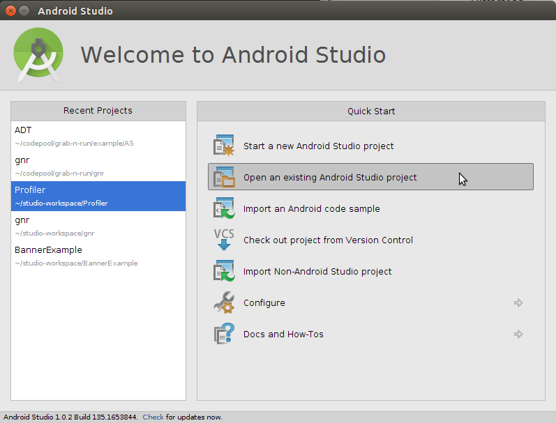
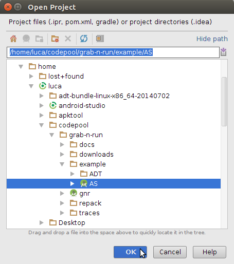
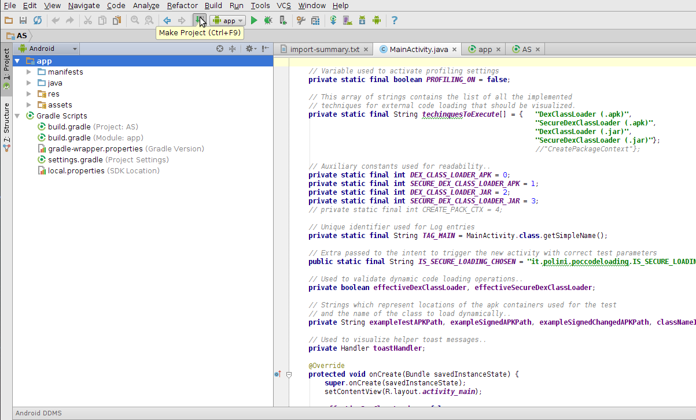
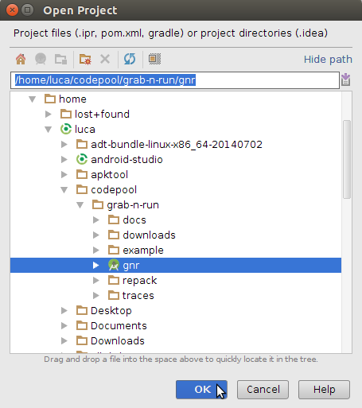
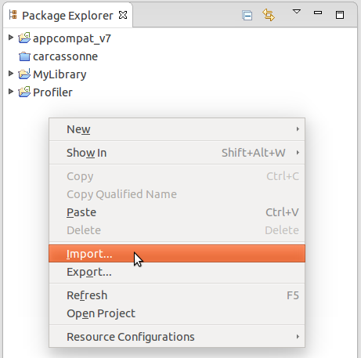
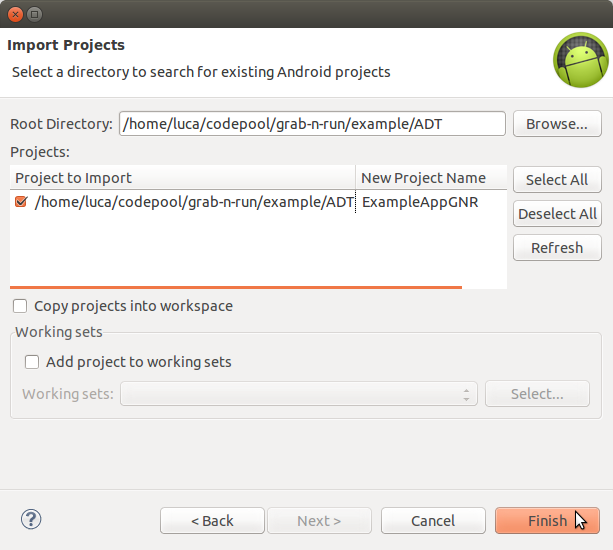
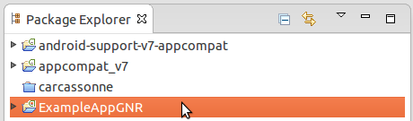

Discussion of an example project
================================

Before digging into this section, you are **strongly** encouraged to read :doc:`tutorial` for an **introductory description** on the features of Grab`n Run library.

The **aim of the sample application** is to give you some *hints on how to use the classes in Grab'n Run and how they will behave across different contexts*. The **source code** of the example can be found in the ``example`` folder of *Grab'n Run* repository.

Different extracts of code will be considered and explained in the following sections of this page but before analyzing the code it may be convenient to retrieve it and to set up an **already prepared Android smart phone emulator** that contains all the containers needed to run the example code..

Retrieve the example code and the emulator
------------------------------------------

Retrieve Grab'n Run full repository
~~~~~~~~~~~~~~~~~~~~~~~~~~~~~~~~~~~

At first you will need to recover *Grab'n Run* example code. In order to do so you need to have **Git** installed on your machine.
The latest version can be found at Git download `page <http://git-scm.com/downloads>`_.

..	highlight:: bash

Next open a terminal and **clone** the example repository into ``grab-n-run``, a local folder located at ``absolute_path_to_gnr_repo``, through Git::

	$ cd <absolute_path_to_gnr_repo>
	$ mkdir grab-n-run
	$ cd grab-n-run
	$ git clone "https://github.com/lukeFalsina/Grab-n-Run.git"

..	highlight:: java

At the end of the process you will have all the GNR code locally including a copy of the *example application* and of the *documentation*.

Include Grab'n Run example code in your IDE 
~~~~~~~~~~~~~~~~~~~~~~~~~~~~~~~~~~~~~~~~~~~

The next step is *importing the example sources* into an **IDE**. The process will be now described for both **Android Studio (AS)** and **Android Development Tool (ADT)**.

a. **Android Studio (AS)**

In the welcome window of Android Studio select from the *Quick Start* menu the option "Open an existing Android Studio project".

Next navigate to the ``grab-n-run`` folder in which you previously cloned the repository and then pick the project ``AS`` from the ``example`` subfolder as shown in the image below.

The example project should have been now successfully imported! It may be necessary to rebulit it again by picking the option "Make Project".

**P.S.** Notice that you can open in *Android Studio* also the **original GNR library project** by using the very same procedure but by picking the ``gnr`` Studio project from the main ``grab-n-run`` folder in stead of the ``example/AS`` one.

b. **Android Development Tool (ADT)**

At first right click in the *Package Explorer* and select "Import.."

Next select under the *Android* folder "Existing Android Code Into Workspace" and then "Next >"

.. image:: images/ADTImportGNR2.png

By pressing the "Browse..." button point the *Root Directory* to the ``grab-n-run`` folder in which you previously cloned the repository and then to the subfolder ``grab-n-run/example/ADT``. You should be now able to the see and select the candidate project ``ExampleAppGNR`` (*an example application which makes use of GNR*). In the end press "Finish" to import the example project. Below you can see a screenshot which summarizes all the settings before the "Finish" button is clicked.

At the end of this process you should have been able to **correctly import** the example application!

Retrieve and set up the emulator
~~~~~~~~~~~~~~~~~~~~~~~~~~~~~~~~

..	highlight:: bash

Then it is time to retrieve the **emulator** used to run the example application. You can easily find it in the ``assets`` folder of the ``example`` repository.
So once that you have located the compressed file ``ExampleAppGNREmu.tar.gz`` containing the emulator, open a terminal and at first copy this file into your *home* folder::

	$ cd <absolute_path_to_gnr_repo>/example/
	$ cp ExampleAppGNREmu.tar.gz ~

Next decompress this container:: 

	$ cd ~
	$ tar xzf ExampleAppGNREmu.tar.gz

This operation will generate two files, a folder called ``ExampleAppGNREmu.avd`` and a configuration file ``ExampleAppGNREmu.ini``. In the end move these two files into the Android emulator folder, normally located at ``/home/<your_username>/.android/avd``::

	$ mv ExampleAppGNREmu.avd ExampleAppGNREmu.ini .android/avd

The last step consist in editing the ``path`` variable stored in the configuration file. So open ``ExampleAppGNREmu.ini`` at the final location with a text editor and change the path variable in order to match the current location of the ``ExampleAppGNREmu.avd`` folder. So if my user name is for example *bill90*, I need to change the path variable from ``path=/home/<USER_NAME>/.android/avd/ExampleAppGNREmu.avd`` to ``path=/home/bill90/.android/avd/ExampleAppGNREmu.avd``. 

..	highlight:: java

Before starting the emulator in your **IDE**, remember to **verify that the SDK version 17** is installed on your machine since the emulator targets that version. Otherwise you can *also edit the emulator configuration* from your IDE to target a different and **more recent** version of the SDK which is installed on your machine.

.. note::
	Android emulator is unfortunately pretty slow and requires also a big bunch of resources and that is the reason why it may be not supported by different machines. A couple of empirical suggestions in this direction are the following:

	* If possible, try to target directly **SDK version 17**, as it results to me that the more recent SDK version you target, the more time the emulator requires before setting up.
	* It is a really good idea to enable the **snapshot feature**. This lets the system frame the current situation of the emulator when you turn it off and load it back whenever you restart the emulator with a *significant reduction of the waiting time*. This `post <http://stackoverflow.com/questions/1554099/why-is-the-android-emulator-so-slow>`_ explains how to enable the feature.
	* Emulator can be switched between landscape and portrait view by pressing ``ctrl + F12``. This can be useful to interact properly with the example application.

When the emulator is finally set up, you can start it in either **ADT Eclipse** or **Android Studio** (it may take time depending on your machine..). Next, whenever you want to run the example code and the IDE asks which device should be used, remember to **select this emulator as the running Android device**.

In case you need to integrate this previous concise walk-through, please give a look at these other resources:
	
	* https://blahti.wordpress.com/2011/08/24/how-to-export-and-import-android-virtual-device-avd-files/
	* http://stackoverflow.com/questions/4575167/android-how-to-copy-the-emulator-to-a-friend-for-testing

List of example containers
--------------------------

In order to understand correctly the following detailed discussion, it is fundamental to first introduce the containers (*jar* and *apk* archives), retrieved for the code loading in the example code. Here is a list of the string variables that store the path to various containers:

* ``exampleSignedAPKPath``: URI of a **benign** toy *apk* container signed with a valid *developer certificate*.
* ``exampleTestAPKPath``: path location pointing to the same **benign** *apk* container but this time signed with the *Android Debug Certificate*. 
* ``exampleSignedChangedAPKPath``: URI pointing to a **handled version** of the same container stored at ``exampleSignedAPKPath`` in which a part of the signatures has been modified.
* ``jarContainerPath``: path location to the **benign** *jar* container used to customize the view elements inside an example activity.
* ``jarContainerRepackPath``: URI pointing to a **malicious repackaged** version of the original container stored at ``jarContainerPath``.

MainActivity.java
-----------------

`MainActivity <https://github.com/lukeFalsina/Grab-n-Run/blob/master/example/src/it/polimi/poccodeloading/MainActivity.java>`_ is the **entry point** of the sample application. In its overloaded method ``onCreate()`` it initializes through a ``ListView`` a set of buttons used to select the *different test cases* present in the application.

DexClassLoader (apk) vs SecureDexClassLoader (apk)
----------------------------------------------------

In this first scenario you will consider how to retrieve an `Activity <http://developer.android.com/reference/android/app/Activity.html>`_ class, whose name is ``NasaDailyImage``, stored in the *apk* container, called *test.apk*, through the use of `DexClassLoader <http://developer.android.com/reference/dalvik/system/DexClassLoader.html>`_ and ``SecureDexClassLoader``.

The relevant **code** in this case is the one of the two methods ``setUpDexClassLoader()`` and ``setUpSecureDexClassLoader()``, which are triggered by tapping the related two buttons on the ``MainActivity`` view.

setUpDexClassLoader()
~~~~~~~~~~~~~~~~~~~~~

In this method a standard initialization of a ``DexClassLoader`` is applied.
So at first the usual **application-private, writable directory** for caching loaded *.dex* classes must be set up.

Then a ``DexClassLoader`` object is initialized using *test.apk*, a container located directly in the phone external storage ( as described by ``exampleTestAPKPath``), as its *jar path* for the classes to load.

Finally the ``NasaDailyImage`` Activity is loaded. If such an operation is successful the **simple name** of the **loaded class** is shown to the user through a *toast message*; otherwise different **exceptions** are raised and show again through a toast message an appropriate helper message.

setUpSecureDexClassLoader()
~~~~~~~~~~~~~~~~~~~~~~~~~~~

In this method **repeated** ``loadClass()`` **calls** are performed on differently initialized ``SecureDexClassLoader`` instances in order to *show different behaviors* of the loader class while retrieving the usual ``NasaDailyImage`` Activity.

At first a ``SecureLoaderFactory`` object is created. Then this instance is used to generate three ``SecureDexClassLoader`` that covers different cases and ends up with different results on the load operation:

1.	**Test case 1:** Load a class through ``SecureDexClassLoader`` without providing an associative map for certificates location

	This first test case shows a **possible error** that a developer may encounter when using this library for the first time.
	If you want to have the location of the certificate being computed by reversing the package name, as explained in :ref:`Reverse package name to obtain remote certificate URL`, you still need to **populate an associative map** with entries like (*"any.package.name"*, **null**) and use it as a parameter of the method ``createDexClassLoader()``. To understand why the class works in this way think of this system as a kind of `white listing <http://en.wikipedia.org/wiki/Whitelist>`_. Only those classes inside package names which are *declared into the associative map* or *directly descend* from one of the declared package names will be considered as possible valid ones, while all classes belonging to a **not listed package name or not a descendant of the declared ones** will be **immediately rejected**.

	And this is exactly what happens in this test case where **no associative map is provided** and so all the classes in the two containers, including the target ``NasaDailyImage``, are **prevented from being loaded** since there is *no clue on the certificate location*.

2.	**Test case 2:** Unsuccessful load of a class through ``SecureDexClassLoader`` with an associative map *(Debug certificate)*

	In the second test case you can see different ways to **populate** the associative map ``packageNamesToCertMap``, used to *link packages with certificates location*.

	.. warning::
		Always keep in mind that **prior** to **downloading** a certificate from the **web** the certificate for that package will be **searched inside the application-private directory** reserved for certificates and then possibly at the remote location. If you wish to *just look at the remote URL* without considering cached certificates, always remember to **wipe out private application data** through the invocation of the method ``wipeOutPrivateAppCachedData()`` **before dismissing** your ``SecureDexClassLoader`` instances. In such a way every time that a new ``SecureDexClassLoader`` is created, you will be sure that no cached resource will be associated with it.

	The first ``put()`` *call* inserts the package name *headfirstlab.nasadailyimage* of the class that we would like to load later in the example and associates it with a **valid remote URL**. What you can immediately notice by pointing your browser to that URL is that the *remote certificate* in this case is a **self-signed developer** one since the **subject** of the certificate is **also** the **issuer** of it but, as it is mentioned in the :doc:`tutorial`, this is perfectly fine in the **Android** environment.

	The *second entry* inserted into the associative map provides a *remote URL* to an **inexistent certificate** (once again you can try to point there your browser to easy spot this out). More over since *no certificate for the package name ``it.polimi.example`` has been already cached into the application-private certificate directory*, then **no certificate** is **available** for it and that is the reason why *any class* belonging to the ``it.polimi.example`` package will be **rejected and prevented from being loaded** by ``SecureDexClassLoader``.

	Lastly the third ``put()`` call on the associative map will insert a package name that will be also used to *construct the remote certificate URL* (**reverse package name**). Once again the final remote URL (``https://polimi.it/example3/certificate.pem``) points to no certificate so any class, whose package name is *it.polimi.example3*, will be rejected from being loaded.

	In the end a ``SecureDexClassLoader`` is generated using as a container file a valid *apk* containing the target class but **signed with a certificate**, the *Debug Android Certificate*, which is different from the one issued by the developer. For such a reason the result of the ``loadClass()`` method will be that *no class object is going to be returned* since the apk is **not signed** with the **required certificate**.

3.	**Test case 3:** Unsuccessful load of a class through ``SecureDexClassLoader`` with an associative map *(Failed signatures verification of some container's entries)*

	In the third test case you can immediately notice that all the settings for the invocation of ``SecureDexClassLoader`` are equals to those of the previous case except for the chosen *apk* container. In fact, while before the container was signed with a non valid certificate, this time the container is signed with the **right certificate** but someone **modified** a couple of the **entries signature**, which do not match anymore with the one obtained during the signing procedure. To sum up also in this case *no class will be loaded* since this container results to be **partially corrupted** and so not safe.

4.	**Test case 4:** Successful load of a class through ``SecureDexClassLoader`` with an associative map

	In this last test case a **successful example** of dynamic code loading is shown. This time ``SecureDexClassLoader`` is initialized with a **valid** *apk* container, **signed** with the **correct developer certificate**, and with the associative map previously initialized in *Test case 2*. The whole process works fine since this associative map contains the necessary key entry *headfirstlab.nasadailyimage* and the related developer **certificate** has been **already cached** during *Test case 2*. Finally during the **signature verification step** inside the ``loadClass()`` method all the entries inside the container match properly with their signature and the certificate used for that signing process is exactly the one linked to *headfirstlab.nasadailyimage* package. That is the reason why *dynamic loading* of ``NasaDailyImage`` activity is **allowed**.

DexClassLoader (jar) vs SecureDexClassLoader (jar)
----------------------------------------------------

A different scenario to show the power of *dynamic code* loading and the **security weakness** of the standard ``DexClassLoader`` is represented by the following example. In this case another activity (the source code is contained into *DexClassSampleActivity.java*) instantiates a certain number of **GUI components** (a couple of buttons, a text view, a switch..) and then **customizes** them according to the methods of an object belonging to the **external** class ``ComponentModifier``, which is **dynamically loaded** at run time.

Depending on the user choice (tapping the first button in stead of the second one) a different extension class of ``ComponentModifier`` is loaded and a different behavior is shown to the user even if the static code shown in ``DexClassSampleActivity`` is exactly the same (as you can easily check by inspecting the method ``onBtnClick()``). This loading operation can be realized easily by means of ``DexClassLoader`` as shown in the method ``retrieveComponentModifier()`` of the source code..

That's just a pity that the container used to load dynamically the class by ``DexClassLoader`` in this example is actually *randomly selected at run time* between either a benign version or a **repackaged one** of the original *apk* and so **malicious code** could potentially have been **executed** *without the user even notice it*!

But let's explain how this could possibly happen: in ``DexClassSampleActivity`` there is a simple private method called ``randomContainerPathChoice()``, which in this case is invoked before the instantiation of both ``DexClassLoader`` and ``SecureDexClassLoader`` and which **select randomly the path** of either the **benign** version of the ``ComponentModifier`` container, stored in the string ``jarContainerPath``, or the path of the **repackaged** one with the string ``jarContainerRepackPath``.

``DexClassLoader`` *won't notice and care* about this difference as long as in both the containers there is an implementation of the required **target class** to load and that is the reason why repeating tapping on the first button ''Click me!'' in the Activity screen multiple times will end up in executing two different version of the same ``FirstComponentModifierImpl`` class. 

On the other hand if you perform the same experiment with ``SecureDexClassLoader`` the repackaged *apk* container choice this time will be detected and blocked during the **signature verification procedure** against the developer certificate in the ``loadClass()`` method. This is possible since *malicious modified entries will not succeed in the signature verification check computed by considering both the initial signature stored inside the container and the developer certificate* retrieved from the associative map used to initialize the ``SecureDexClassLoader`` instance. Thanks to this, ``SecureDexClassLoader`` **won't load** the customization classes inside the *repackaged container* and it will just **end up the activity**, which is exactly the **secure** behavior that you, *as a developer*, would like to obtain :)  

.. Create PackageContext
.. ---------------------

.. Coming soon.. More or less ;)