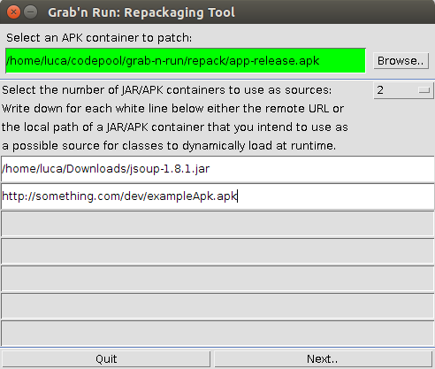
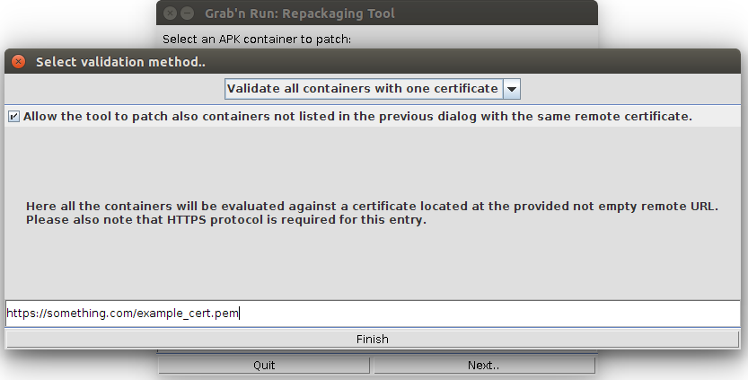
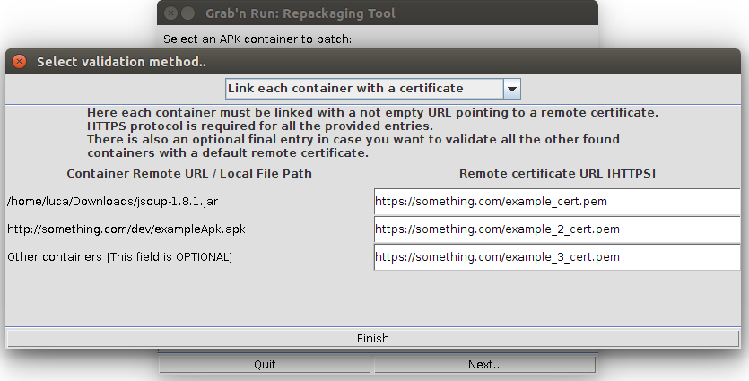
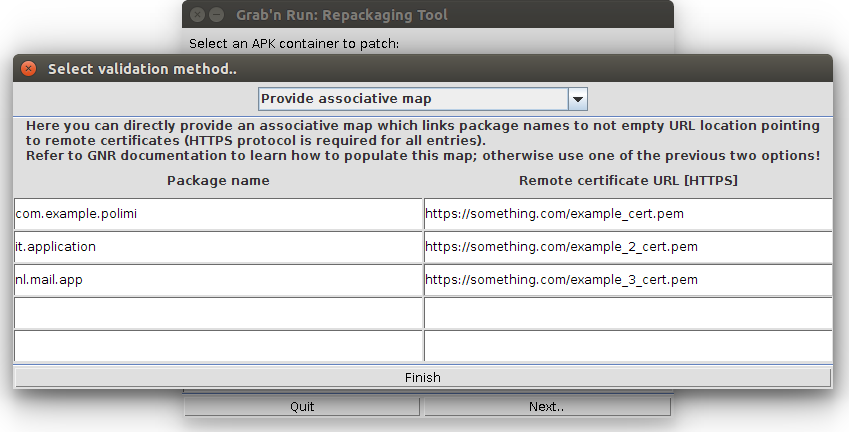

Repackaging tool
================

In this section you will learn how to configure and use the repackaging tool to have your applications rewritten automatically to use the Grab'n Run library.
The repackaging tool allows you to:

* Rewrite your application to use Grab'n Run secure API instead of the standard Android ones. This process is automatic and requires only a couple of settings from your side. 
* Granular control on the security policy that you want your application to follow at run time when performing dynamic code loading (e.g., validate all the dynamically loaded code against one certificate, validate each container against a different certificate, decide whether to provide a default trusted certificate for all the not specified entries).

This tool relies on `Androguard <https://github.com/androguard/androguard>`_ to decoded, decompile, and rebuild the application provided as input.

A prerequisite for using the tool is that your local machine must be able to have Internet connectivity since it will be necessary for the tool to download the source containers declared as potential sources for dynamic code loading unless they result directly accessible on the file-system of your machine.

Another prerequisite is that you have already successfully installed `apktool <http://ibotpeaches.github.io/Apktool/install/>`_ on your local machine.

Use
---

.. highlight:: bash

1. Open a terminal and move to the repackaging tool script *repackPOC* directory and then install the required dependencies::

	$ cd <absolute_path_to_GNR_folder>/repackPOC
	$ pip install -r requirements.txt

2. Run the script::

	$ python repackagingTool.py

3. For a list of the optional arguments::

	$ python repackagingTool.py -h

Configuration
-------------

.. highlight:: java

Before having the repackaging tool executed, you will have to go through a couple of windows to configure how you want your application to be patched. In particular:

1. You have to select which application, in the form of an APK container, you want to patch.
2. You have to provide the JAR or APK containers used as sources for dynamic code loading.
3. You need to specify a security policy that will be used to evaluate whether the containers used as sources are genuine at runtime.

You can customize these settings easily thanks to a simple UI presented whenever the script is started.

Step 1: Select the application to patch
~~~~~~~~~~~~~~~~~~~~~~~~~~~~~~~~~~~~~~~

Select the application you want to patch to use the secure Grab'n Run APIs. Notice that this application must be a regular APK file, which is stored locally on your machine.

It is not required for this container to be aligned, or signed, but notice that you will *have to* sign, and then align the final application generated by the script in order to have it installed on the user's devices.

If you are not familiar on how to *sign*, and *align* an APK, you may want to check the third bullet point of the "Quick example of use" section in the ``README`` file of the Grab'n Run repository on GitHub.

Step 2: Select the containers sources for DCL
~~~~~~~~~~~~~~~~~~~~~~~~~~~~~~~~~~~~~~~~~~~~~

Next step is listing all the JAR, or APK containers used by your application as sources for dynamic code loading. Each container can be either stored locally (in this case indicate the absolute path on the file system), or remotely on an endpoint (in this case simply type the URL pointing to the file, and notice that both HTTP and HTTPS protocol are supported).

.. warning::
	In case of a JAR contianer, verify that you have already translated its content into Dalvik bytecode. Containers that have been gone through this process present a
	specific entry named ``classes.dex``. If you provide a container without such an entry, the repackaging tool will simply ignore it.

The screenshot below shows the first screen of the UI with an example of a feasible configuration for Step 1 and Step 2.

Step 3: Configure the security policy for the source containers
~~~~~~~~~~~~~~~~~~~~~~~~~~~~~~~~~~~~~~~~~~~~~~~~~~~~~~~~~~~~~~~

Once you confirm the settings in the first window, you will be prompted with a new screen to decide against which certificate each source container should be verified by Grab'n Run. At the moment we support three policies:

a. Evaluate all the containers against one certificate.
b. Evaluate each container against a different certificate.
c. Provide a validation mapping, which has on the left side the prefix of the package name of the involved classes, and on the right side the corresponding certificate to use for the evaluation.

The three screenshots below show an example of a valid configuration for each of the three policy. Switching from one to another is as simple as picking a different value in the drop-down menu box on top of the UI.

Some further considerations for this step:

* You must provide each certificate through a remote reference to a secure endpoint containing such resource. The use of HTTPS protocol for the endpoint is required, and, if this is not the case, the repackaging tool will enforce it.
* For the first two policies you can select as source containers either archives stored locally on your machine (use the absolute path of these resources on the file-system), or a remote endpoint containing such container (use its URL). In the latter case the repackaging tool will take care, when started, to retrieve these containers for further analysis. For these two policies, you can optionally also provide a default certificate that will be used for evaluating any other source container, which was not listed in the previous step but is used by your application at run time. 
* For the third policy the most restrictive package name prefix will be applied during the evaluation: This means that if your application wants to load code for a class, whose full name is ``com.example.myapp.MyClass``, and you have two entries in your mapping, one for ``com.example`` and the other for ``com.example.myapp``, the certificate associated to the latter one will be used since this entry has a longer prefix matching the name of the class to load. You should consider to use the last policy only if you are really aware of how the system works (see :doc:`tutorial`, and :doc:`complementary` for further details on the mapping process); in general, using one of the two first policies is already enough for most of the use cases, and it avoids pain from your side since the tool handles automatically the process of generating a validation mapping from your settings.

Step 4: Gotta patch them all!
~~~~~~~~~~~~~~~~~~~~~~~~~~~~~

Once you enter your settings and you press the "*Finish*" button, the repackaging tool will start its execution. If no error is raised, the patched APK will be available in the main folder where you launched the script from terminal (take extra care of having the original application in a different folder unless you want it to be overwritten by the patched version).

I hope you will find this tool useful and I am eager to hear your feedbacks :)