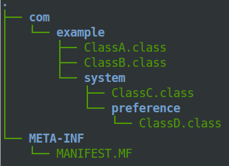

Quick start and tutorial
========================

In this section you will see how to *retrieve and include Grab'n Run library* into your project (either by using Android Development Tool or Android Studio). After this setup step a **brief tutorial** will explain how to use classes in the library to **secure** the *dynamic code loading operations*.

Since this section is **introductory** and more descriptive, it should be read by those who are not familiar with this library or more in general with *class loading* in Android. On the other hand the :doc:`javaAPI/packages` section provides a more complete and detailed view on Grab'n Run library and its insights, while :doc:`example` shows a simple use case of the concepts introduced here.

Retrieve Grab'n Run
-------------------

TODO

Include Grab'n Run in your project
----------------------------------

TODO

Android Development Tool (ADT)
~~~~~~~~~~~~~~~~~~~~~~~~~~~~~~

TODO

Android Studio
~~~~~~~~~~~~~~

TODO

Tutorial
--------

This tutorial assumes that you have *already retrieved and imported Grab'n Run* into your Android project.

Using standard DexClassLoader to load code dynamically
~~~~~~~~~~~~~~~~~~~~~~~~~~~~~~~~~~~~~~~~~~~~~~~~~~~~~~

Let us pretend that you want to dynamically load an external class through `DexClassLoader <http://developer.android.com/reference/dalvik/system/DexClassLoader.html>`_, a class in the *Android API* used to load classes from *jar* and *apk* files containing a **classes.dex** entry. This is a convenient way to execute code not installed as part of an application package.

Let's assume, for example, that you want to load an instance of ``com.example.MyClass`` located in the container *exampleJar.jar*, stored in the *Download* folder of the sd_card on the target phone. Note that this scenario may potentially lead to a **code injection** attack when you use the standard ``DexClassLoader`` since you are choosing to load code from a container which is stored in a **world writable location** of your phone. Notice that this kind of attack would be prevented with ``SecureDexClassLoader``.
Anyway a snippet of code to achieve this task is the following::

		MyClass myClassInstance = null;
		String jarContainerPath = Environment.getExternalStorageDirectory().getAbsolutePath() + "/Download/exampleJar.jar";
		File dexOutputDir = getDir("dex", MODE_PRIVATE);
		DexClassLoader mDexClassLoader = new DexClassLoader(	jarContainerPath, 
									dexOutputDir.getAbsolutePath(), 
									null, 
									getClass().getClassLoader());
		
		try {
			Class<?> loadedClass = mDexClassLoader.loadClass("com.example.MyClass");
			myClassInstance = (MyClass) loadedClass.newInstance();

			// Do something with the loaded object myClassInstance
			// i.e. myClassInstance.doSomething();

		} catch (ClassNotFoundException e) {
			e.printStackTrace();
		} catch (InstantiationException e) {
			e.printStackTrace();
		} catch (IllegalAccessException e) {
			e.printStackTrace();
		}

The String ``jarContainerPath`` contains the path to *examplejar*, while ``dexOutputDir`` is an **application-private**, writable directory to cache optimized *dex* classes into *examplejar*. As reported in ``DexClassLoader`` documentation, you can retrieve ``dexOutputDir`` in different ways but it is fundamental that this cache folder is application-private; otherwise your application may be subjected to **code injection attacks**. And by the way this kind of attack is *prevented* if you choose to use ``SecureDexClassLoader`` as explained later on in this guide.

The object ``mDexClassLoader`` is then initialized as a ``DexClassLoader`` instance, which loads all the classes
into *examplejar* and caches their optimized version into ``dexOutputDir``. No native library is included
since the third parameter of the constructor is ``null`` and the `ClassLoader <http://developer.android.com/reference/java/lang/ClassLoader.html>`_ of the current activity is passed as parent class loader.

Finally the designated class is, at first, loaded by invoking the ``loadClass()`` method on ``mDexClassLoader`` with the **full class name** provided as a parameter and, secondly, instantiated through the ``newInstance()`` method and the forced
casting to ``MyClass``. The three different **catch blocks** are used to handle different exceptions that may be raised during the process.

.. note::
	Notice that a **full class name** is required to successfully load a class and so the **complete package name** separated by dots must **precede** the **class name**.
	Referred to the example, full class name is ``com.example.MyClass`` and not just the short class name ``MyClass``, which would produce a failure in the class loading operation.
	In particular if it is the case that a short class name is provided in stead of a full one, it is likely that a ``ClassNotFoundException`` will be raised at runtime.

This snippet of code is perfectly fine and working but it is **not completely secure** since neither integrity on the container of the classes, neither authentication on the developer of the container are checked before executing the code.
And here comes ``SecureDexClassLoader`` to solve these issues.  

Using SecureDexClassLoader to load dynamic code securely 
~~~~~~~~~~~~~~~~~~~~~~~~~~~~~~~~~~~~~~~~~~~~~~~~~~~~~~~~

In order to improve the security of the snippet of code shown in `Using standard DexClassLoader to load code dynamically`_
a new version of the code is presented through the use of ``SecureDexClassLoader`` and ``SecureLoaderFactory``.

At first you should create a ``SecureLoaderFactory`` object as shown here::

		SecureLoaderFactory mSecureLoaderFactory = new SecureLoaderFactory(this);

This is an helper class necessary to generate a ``SecureDexClassLoader`` object.
But before performing this step you have to initialize and provide to ``mSecureLoaderFactory`` an **associative map** 
which links all the package names of the classes that you want to dynamically load to one *developer certificate*,
which is stored at a **secure web location** (i.e. an HTTPS link) and which was previously used 
to sign the *jar* or *apk* container which holds those classes.

**Developer Certificate**
	a certificate, which in Android can be even *self-signed*, used to sign all the entries
	contained in a *jar* or in an *apk* container. Notice that in the Android environment in order to run 
	an application on a smart phone or to publish it on a store, the *signing step* is **mandatory** and can be 
	used to check that an *apk* was actually written and approved by the issuer of the certificate.
	For more details on signing applications and certificate, please check `here <http://developer.android.com/tools/publishing/app-signing.html#cert>`_.

So in this example we assume that all the classes belonging to the package ``com.example`` have been signed 
with a self-signed certificate, stored at ``https://something.somethelse.com/example_cert.pem``.
Since here you just want to load ``com.example.MyClass`` the following snippet of code is enough::

		Map<String, URL> packageNamesToCertMap = new HashMap<String, URL>();
		try {
			packageNamesToCertMap.put("com.example", new URL("https://something.somethelse.com/example_cert.pem"));

		} catch (MalformedURLException e) {
			// The previous URL used for the packageNamesToCertMap entry was a malformed one.
			Log.e("Error", "A malformed URL was provided for a remote certificate location");
		}
		

.. note::
	Any *self-signed certificate* can be used to validate classes to load as long as it is not 
	expired and it suits the standard `X509 Certificate <http://docs.oracle.com/javase/7/docs/api/java/security/cert/X509Certificate.html>`_ format. The only exception is
	represented by the **Android Debug Certificate**, a certificate used to sign applications before
	running them in debug mode and not safe to use during production phase.
	``SecureDexClassLoader`` has been instructed to automatically reject class loading for classes 
	whose package name has been associated for signature verification to the **Android Debug Certificate** 
	and so **DO NOT USE IT** to check the signature of your containers.

.. note::
	You may want to insert more than one entry into the associative map. This is useful whenever you want to
	use the same ``SecureDexClassLoader`` to load classes which belong to different packages. Still 
	remember that each package name can only be associated with **one and only one** certificate location.
	Pushing into the associative map an entry with an already existing package name will simply overwrite 
	the previously chosen location of the certificate for that package name.

.. note::
	For each entry of the map only an **HTTPS** link will be accepted. This is necessary in order to 
	**avoid MITM (Man-In-The-Middle)** attacks while retrieving the *trusted* certificate. In case that an **HTTP**
	link is inserted, ``SecureLoaderFactory`` will enforce *HTTPS protocol* on it and in any case whenever 
	no certificate is found at the provided URL, no dynamic class loading will succeed for any class of 
	the related package so **take care to verify** that certificate URL is correctly spelled and working via **HTTPS** protocol.

Now it comes the time to initialize a ``SecureDexClassLoader`` object through the method ``createDexClassLoader()``
of ``SecureLoaderFactory``::

		SecureDexClassLoader mSecureDexClassLoader = mSecureLoaderFactory.createDexClassLoader(	jarContainerPath, 
													null, 
													getClass().getClassLoader(),
													packageNamesToCertMap);

``mSecureDexClassLoader`` will be able to load the classes whose container path is listed in ``jarContainerPath`` and 
it will use the ``packageNamesToCertMap`` to retrieve all the required certificate from the web and import them into 
an application private certificate folder. Also notice that in this case no directory to cache output classes is needed
since ``SecureDexClassLoader`` will automatically reserve such a folder.

.. note::
	As stated in the `API documentation <http://developer.android.com/reference/dalvik/system/DexClassLoader.html#DexClassLoader(java.lang.String, java.lang.String, java.lang.String, java.lang.ClassLoader)>`_ ``jarContainerPath`` may link many *different containers* separated by ``:`` and 
	for such a reason the **developer is responsible** of filling the associative map of the certificates location
	accordingly with all the entries needed to cover all the package names of the classes to be loaded.

.. note::
	``DexClassLoader``, the standard class from Android API, is able to parse and import only those *jar* and *apk* 
	containers listed in ``jarContainerPath`` which are directly saved on the mobile device storage. In addition to this 
	``SecureDexClassLoader`` is also capable of **downloading remote containers** from the web 
	(i.e. **HTTP or HTTPS URL**) and to import them into an application-private directory to avoid code injections 
	from attackers.
	
	Example::

		jarContainerPath = "http://something.somethingelse.com/dev/exampleJar.jar";

	This ``jarContainerPath`` will retrieve no resource when used in the constructor of ``DexClassLoader`` but it 
	is perfectly fine as a first parameter of the ``mSecureLoaderFactory.createDexClassLoader()`` call, as long as
	a *jar* container is actually stored at the remote location.

Finally you can use the resulting ``mSecureDexClassLoader`` to load the desired class in a similar fashion to ``DexClassLoader``::

	 	try {
			Class<?> loadedClass = mSecureDexClassLoader.loadClass("com.example.MyClass");

			// Check whether the signature verification process succeeds
			if (loadedClass == null) {

				// One of the security constraints was violated so no class
				// loading was allowed..
			}
			else {

				// Class loading was successful and performed in a safe way.
				myClassInstance = (MyClass) loadedClass.newInstance();

				// Do something with the loaded object myClassInstance
				// i.e. myClassInstance.doSomething();
			}

		} catch (ClassNotFoundException e) {
			// This exception will be raised when the container of the target class
			// is genuine but this class file is missing..
			e.printStackTrace();
		} catch (InstantiationException e) {
			e.printStackTrace();
		} catch (IllegalAccessException e) {
			e.printStackTrace();
		}

It is important to notice that, differently from ``DexClassLoader``, the ``mSecureDexClassLoader.loadClass()`` call will 
return ``null``  whenever **at least one of the following security constraints is violated**:

* The *package name* of the class used as a parameter of ``loadClass()`` was **not previously included in the associative
  map** and so it do not exist any certificate that could be used to validate this class.
* The *package name* of the class used as a parameter of ``loadClass()`` was previously included in the associative map
  but the **related certificate** was **not found** (URL with no certificate file attached or no connectivity) or **not valid** 
  (i.e. expired certificate, use of the Android Debug Certificate).
* The *container file* of the required class was **not signed**.
* The *container file* of the required class was **not signed with the certificate associated** to the package name 
  of the class. [Missing trusted certificate]
* At least one of the **entry** of the *container file* do **not match its signature** even if the certificate used to sign
  the container file is the trusted one. [Possibility of repackaged container]

For all of these reasons you should always check and pay attention when a **null** pointer is returned after a 
``mSecureDexClassLoader.loadClass()`` call since this is a clear clue to establish either a wrong set up of 
``SecureLoaderFactoty`` and ``SecureDexClassLoader`` or a security violation. 
*Informative and debug messages* will be generated in the logs by the classes of the Grab'n Run library in order 
to help you figure out what it is happening.

.. note::
	Every time that ``SecureDexClassLoader`` finds out a (possibly repackaged) **invalid container**, it will immediately 
	**delete** this file from its **application-private directory**. Nevertheless if this container is *stored on your device* 
	it may be a good idea for you, as a developer, after having double checked that you have properly set up ``SecureDexClassLoader``, 
	to **look for a fresh copy** of the container or at least **not to trust** and delete this container from the phone.

Please notice, on the other hand, that the three exceptions caught in the try-catch block surrounding the ``loadClass()`` method 
behaves and are thrown in the same way as it would happen with ``DexClassLoader``.

Finally for clarity the full snippet of code presented in this section is reported here::

		MyClass myClassInstance = null;
		jarContainerPath = "http://something.somethingelse.com/dev/exampleJar.jar";

		try {
			Map<String, URL> packageNamesToCertMap = new HashMap<String, URL>();
			packageNamesToCertMap.put("com.example", new URL("https://something.somethelse.com/example_cert.pem"));

			SecureLoaderFactory mSecureLoaderFactory = new SecureLoaderFactory(this);
			SecureDexClassLoader mSecureDexClassLoader = mSecureLoaderFactory.createDexClassLoader(	jarContainerPath, 
														null, 
														packageNamesToCertMap, 
														getClass().getClassLoader());
		
			Class<?> loadedClass = mSecureDexClassLoader.loadClass("com.example.MyClass");

			// Check whether the signature verification process succeeds
			if (loadedClass == null) {

				// One of the security constraints was violated so no class
				// loading was allowed..
			}
			else {

				// Class loading was successful and performed in a safe way.
				myClassInstance = (MyClass) loadedClass.newInstance();
				
				// Do something with the loaded object myClassInstance
				// i.e. myClassInstance.doSomething();
			}

		} catch (ClassNotFoundException e) {
			// This exception will be raised when the container of the target class
			// is genuine but this class file is missing..
			e.printStackTrace();
		} catch (InstantiationException e) {
			e.printStackTrace();
		} catch (IllegalAccessException e) {
			e.printStackTrace();
		} catch (MalformedURLException e) {
			// The previous URL used for the packageNamesToCertMap entry was a malformed one.
			Log.e("Error", "A malformed URL was provided for a remote certificate location");
		}

Wiping out cached containers and certificates
~~~~~~~~~~~~~~~~~~~~~~~~~~~~~~~~~~~~~~~~~~~~~

In order to *improve performance* and offer the possibility to *partially work also when connectivity is limited*, 
``SecureDexClassLoader`` will store certificates retrieved from the web and all containers into specific **application-private directories**.

Every time that a **resource** (container or certificate) is needed to load or verify a class, ``SecureDexClassLoader`` will at first 
look for it inside its private directories and then, if no match is found, possibly attempt to download it from the web or found it 
at a specified location on the device (this last option is applicable only for containers).

.. It was also stated into `Using SecureDexClassLoader to load dynamic code securely`_ that, differently from
.. ``DexClassLoader``, ``SecureDexClassLoader`` is also able to **download and import remote containers** into an
.. *application-private folder*.

Even if these **caching features** may come really useful and *speed up* significantly ``SecureDexClassLoader`` execution,
it would be also nice for the developer to have the possibility to **choose** whether a **fresh or cached copy** of either a 
certificate or a container should be used for the *dynamic loading operations*. And that is the reason why ``SecureDexClassLoader``
provides a method called ``wipeOutPrivateAppCachedData()`` to manage this choice.

To present this method let us consider again the previous scenario shown in `Using SecureDexClassLoader to load dynamic code securely`_: 
after having tried to load ``com.example.MyClass``, if you want to *delete both the cached certificates and the containers* used by the 
related ``mSecureDexClassLoader``, in order to impose for the next loading operation the retrieval of **fresh resources**, the call to 
perform is the following::

		mSecureDexClassLoader.wipeOutPrivateAppCachedData(true, true);

.. note::
	After that you *have erased at least one cached resource between the certificates and the containers*, ``mSecureDexClassLoader``
	will always return ``null`` for **consistency reason** to any invocation of the ``loadClass()`` method. 
	So it will be **necessary** for you to require a **new** ``SecureDexClassLoader`` instance to ``SecureLoaderFactory``
	through the invocation of the ``createDexClassLoader()`` method before being able to dynamically and securely load other classes.

Complementary topics
--------------------

In the end of this pages a couple of not so trivial use cases of *Grab'n Run* are presented. This section will not introduce new core concepts but it may help the developer to handle some **tricky situations**. For such a reason feel free to **skip this part** and eventually **come back later** to revise it whenever you will encounter one of the following situation while using the library.

Handle containers whose classes come from different package names which have a common relevant prefix
~~~~~~~~~~~~~~~~~~~~~~~~~~~~~~~~~~~~~~~~~~~~~~~~~~~~~~~~~~~~~~~~~~~~~~~~~~~~~~~~~~~~~~~~~~~~~~~~~~~~~

Before starting diving in this section it is important to recall the **relationship between package name and containers**. 

**Package name in apk containers**
	*Apk* containers must contain just **one package name**, which must be chosen by the developer when a new application is created. The package name is then stored in the *Android Manifest* of the application. In order to have an application being admitted on the *Google Play* store, it is also fundamental that the chosen package name is **unique** and should **not change** for the whole life cycle of the application.

**Package name in jar containers**
	*Jar* containers on the other hand do **not** have such a **strict policy** as in *apk* containers. Hypothetically each class file contained in a *jar* archive may have a different package name and this mean that **many package names** can be present in the **same** *jar* container.

**Common relevant prefix**
	In *Grab'n Run* two package names share a relevant common prefix if their prefix match for at least two words separated by one dot.
	
	**Example:**
	Consider the following package names: 

	A. ``com.example.polimi``
	B. ``it.example.polimi``
	C. ``com.test``
	D. ``com.example.application.system``
	E. ``com.example.polimi.system``

	* A. and B. do **not** share any **common relevant prefix** since they differ in the initial word of the package name (``com`` vs ``it``).
	* A. and C. do **not** share any **common relevant prefix** since they just have one word of the package name in common (``com``).
	* A. and D. share a **common relevant prefix** (``com.example``).
	* A. and E. share a **common relevant prefix** (``com.example.polimi``).

Given these insights a first interesting situation to consider is when a developer wants to *load dynamically classes* from an external *jar* library which contains **more than one package name** that, anyway, share a **common relevant prefix**. Let us assume for example that the target library has the following structure:

In such a scenario we have four classes (``ClassA``, ``ClassB``, ``ClassC``, ``ClassD``) which belongs to **three different packages**, whose names are respectively ``com.example``, ``com.example.system`` and ``com.example.system.preference``. Let use also assume that this container has being signed with a *valid self-signed certificate*, remotely located at ``https://something.somethelse.com/example_cert.pem``.

Questions now for the developer are:

1. *How should I fill in the associative map which links package names to remote certificate location in order to being able to load all the classes in this container?*
2. *Am I obliged to insert all three package names pointing to the very same certificate?*

Luckily the answer for the second question is **no**, which means that there is indeed an **easier way** to perform the job. *Grab'n Run* in fact was thought to make the whole dynamic class loading **secure but** at the same time **simple** for applications developers.

You can in fact handle this situation correctly by simply inserting into the associative map a **single entry** where the *key corresponds to the shortest among the package names* belonging to one of the classes that need to be loaded and the *value is the location of the remote certificate* used to sign the container. So in the **previous case** since the classes with the shortest package name are ``com.example.ClassA`` and  ``com.example.ClassB`` the following code is appropriate to populate the map::

		Map<String, URL> packageNamesToCertMap = new HashMap<String, URL>();

		try {
			packageNamesToCertMap.put("com.example", new URL("https://something.somethelse.com/example_cert.pem"));

		} catch (MalformedURLException e) {
			
			// The previous entry for the map may not necessarily be the right one 
			// but still it is not malformed so no exception should be raised.
			Log.e(TAG_MAIN, "A malformed URL was provided for a remote certificate location");
			
		}

For the rest the developer may proceed as shown in `Using SecureDexClassLoader to load dynamic code securely`_. The result will be that the container is going to be verified against the appropriate certificate and, if it is **genuine**, it will be *also possible to load the other two classes* in the archive with a **different package name** (``com.example.system.ClassC`` and ``com.example.system.preference.ClassD``).

Handle containers whose classes come from different package names with no relevant common prefix
~~~~~~~~~~~~~~~~~~~~~~~~~~~~~~~~~~~~~~~~~~~~~~~~~~~~~~~~~~~~~~~~~~~~~~~~~~~~~~~~~~~~~~~~~~~~~~~~

Even if it is not such a common situation it is possible for a *jar* archive to *contain classes which belongs to different package names* and does not share any common relevant prefix.
This situation, on the other hand, is **not practical** for *apk* containers since, in order to be **published** on Google Market, 
an application needs to have a **single** package name which more over must **not change** during its whole life cycle.

Anyway let us try to sketch the case of the previous cited jar archive and how to handle it with ``SecureDexClassLoader``. As an example we can consider the 
scenario in which the goal is loading two classes, whose full class names are respectively ``com.example.MyFirstClass`` and ``com.test.MySecondClass`` and so 
which **differs** in the **package name** but are **both stored** in the **same container** ``exampleJar.jar``.
It is also supposed that this container has being signed with a *valid self-signed certificate*, remotely located at ``https://something.somethelse.com/example_cert.pem``.

In order to handle this situation correctly the developer is required to fill the **associative map** which links package names and certificates
with **two entries**, one per each package name, which will *point to the same remote certificate*. This is exemplified in the following snippet of code::

		Map<String, URL> packageNamesToCertMap = new HashMap<String, URL>();

		try {
			packageNamesToCertMap.put("com.example", new URL("https://something.somethelse.com/example_cert.pem"));
			packageNamesToCertMap.put("com.test", new URL("https://something.somethelse.com/example_cert.pem"));

		} catch (MalformedURLException e) {
			
			// The previous entries for the map may not be necessarily the right ones 
			// but still they are not malformed so no exception should be raised.
			Log.e(TAG_MAIN, "A malformed URL was provided for a remote certificate location");
			
		}

For the rest the developer may proceed as shown in `Using SecureDexClassLoader to load dynamic code securely`_ and this procedure grants to succeed in the loading
process for any of the two classes independently on the order in which they are attempted to be loaded.

.. note::
	By design ``SecureDexClassLoader`` assumes that **each package name** is intrinsically related to a **single container**, while it is not necessary true the opposite.
	This means that attempting to *load a class*, whose **package name** is associated with **more than one container** provided in *dexPath* (i.e. each one of the two 
	containers contains at least one class with the same package name), will generate an **unpredictable behavior** since ``SecureDexClassLoader`` will associate 
	that package name with just one of the two containers.

	So it is a **developer responsibility** to check the containers in order to avoid the occurrence of this rare but undesirable situation.

Reverse package name to obtain remote certificate URL
~~~~~~~~~~~~~~~~~~~~~~~~~~~~~~~~~~~~~~~~~~~~~~~~~~~~~

*Grab'n Run* provides as an extra feature the possibility to **reconstruct the remote URL location of the certificate by reversing the package name** provided into the associative map. To enable this feature simply add an entry to the associative map where the **key** is the **desired package name to reverse** and the **value** is ``null``.
Here is a simple snippet of code to exemplify::

		Map<String, URL> packageNamesToCertMap = new HashMap<String, URL>();

		// A null entry can't raise a MalformedURLException..
		packageNamesToCertMap.put("it.polimi.necst.mylibrary", null);

What is going on behind the curtains is that whenever GNR find an entry with *a valid package name associated to a null value*, it will **reverse the package name** with the following convention:

	The **first word** of the package name will be considered as the **top level domain (TLD)**, while the **second** one is going to be the **main domain**. Any **following word** of the package name will be used in the **same order** as they are listed to define the **file path** on the remote server and of course since a secure connection is needed for the certificate, **HTTPS protocol** will be enforced.

Let us translate this theory with some concrete examples::
* Package name ``it`` won't be reverted since it contains just a world (at least two are required for real world package name).
* Package name ``it.polimi`` will be reverted to the URL ``https://polimi.it/certificate.pem``.
* Package name ``it.polimi.necst.mylibrary`` will be reverted to the URL ``https://polimi.it/necst/mylibrary/certificate.pem``.

As you can see from the previous examples this naming convention assumes that the **final certificate** will be found in the *remote folder obtained by reverting the package name* and that the **certificate file** will have been **always renamed** ``certificate.pem``.

Perform dynamic code loading concurrently
~~~~~~~~~~~~~~~~~~~~~~~~~~~~~~~~~~~~~~~~~

TODO

.. * By now use SecureDexClassLoader in Lazy mode. Instantiate such an object on the main thread.
.. * Initialize a thread executor and then makes each thread load a class from the same SecureDexClassLoader object. Evaluation of containers will be performed only by the first thread to load a class into a container while the others will use the cached verification mechanism to directly load or reject loading for their target class.
.. * Remember to put a join instruction at the end of the code block on the main thread to be sure that after that line all the classes that you need have attempted to being loaded.    

On library developer side: how to prepare a valid library container compatible with GNR
~~~~~~~~~~~~~~~~~~~~~~~~~~~~~~~~~~~~~~~~~~~~~~~~~~~~~~~~~~~~~~~~~~~~~~~~~~~~~~~~~~~~~~~

For once in this tutorial the **focus is now moved** from the *application developer*, who wants to load classes from an external library, **to the library developer**, who wrote a library and wants to make it available to the application developers.

What we are going to discuss about in this section is **how a library developer should prepare his/her library** in order to have it **compatible with GNR** system and more in general with **dynamic code loading**. A hint in this sense is provided by DexClassLoader `documentation <http://developer.android.com/reference/dalvik/system/DexClassLoader.html>`_, which states clearly that this class, and so also ``SecureDexClassLoader`` does, *"loads classes from .jar and .apk files containing a classes.dex entry."*.

So let us assume that you, as a library developer, want to export your project called "MyLibrary" into a *jar* archive compatible with ``SecureDexClassLoader``. The following steps should be performed:

1. **Export the project "MyLibrary" into a jar archive.**

	In the ADT (Android Development Tool) right-click on the project *"MyLibrary"* and select *"Export..."*.

	.. image:: ExportJarOption.png

	Then choose the option "Jar File" and click "Next...".

	.. image:: ExportJarFile.png

	Finally choose the location of the exported *jar* archive by clicking on the "Browse..." button and then "Finish".

	.. image:: ExportJarFinish.png

	You have now successfully exported your project into a *jar* container.

2. **Translate Java Byte Code (.class) into Dalvik Byte Code (classes.dex).**

	After having exported your project into a *jar* container you now have code that can run on a **Java Virtual Machine (JVM)** in the form of class file with the extensions ``.class``. Nevertheless in order to have your **code running** with ``SecureDexClassLoader`` **on an Android phone** it is necessary to **translate** the class files from Java Bytecode to **Dalvik Bytecode**. This task can be accomplished easily thanks to the ``dx`` tool, present in the Android SDK folder.

	..	highlight:: bash

	So by assuming that you have just exported the project into a file called *myLibrary.jar* in a terminal type the following commands::

	$ cd <path_to_exported_jar>
	$ /<path_to_sdk>/build-tools/<last_stable_sdk_version>/dx --dex --output=myLibrary-dex.jar myLibrary.jar

	The result is an output *jar* container called *myLibrary-dex.jar*. You can easily spot that no ``.class`` file is stored in this container and in stead a file called ``classes.dex`` was added. This is the direct **result of the translation** mentioned before. 

3. **Generate a keypair and export the developer certificate**

	If this is the first time that you sign a container you will need to **generate a key pair** with ``keytool`` and then **export a certificate** containing the newly created public key. 
	Otherwise if you *already have a key pair and the associated certificate, simply skip this section* and continue reading from the next one.

	In order to **generate a keystore and a key pair** type in the following command line in a terminal::

	$ keytool -genkey -v -keystore my-release-key.keystore -alias alias_name -keyalg RSA -keysize 2048 -validity 10000  

	This line prompts you for passwords for the keystore and private key, and to provide the Distinguished Name fields for your key. It then generates the keystore as a file called ``my-release-key.keystore``. The keystore will contain a single key, valid for 10000 days. The **alias** is a name that you choose to **identify keys** inside the keystore. In this case this private key will be identified as ``alias_name``.

	If the previous step succeeded, now it is time to **export your developer certificate** that will be used by *application developers to verify your library code before dynamically loading it*. This can be accomplished again thanks to a ``keytool`` feature::

	$ keytool -exportcert -keystore my-release-key.keystore -alias alias_name -file certificate.pem

	This command will export the certificate embedding the public key associated to the private key whose alias is ``alias_name``. This certificate will be stored in the file ``certificate.pem``.

	Even if the previous commands are all that you will need here, if you desire to deepen your knowledge on *keystore, keys and signing Android applications* visit these reference links:

	* https://www.digitalocean.com/community/tutorials/java-keytool-essentials-working-with-java-keystores
	* http://developer.android.com/tools/publishing/app-signing.html#signing-manually

4. **Sign the library with the developer private key.**

	Now it is time to **sign** the *jar* library with the **library developer private key** to enable the possibility to verify it.

	Assuming that you have generated a private key whose alias is ``alias_name`` and stored it in a keystore whose name is ``my-release-key.keystore`` in order to sign the *jar* container manually type in this line in your terminal::

	$ jarsigner -verbose -sigalg SHA1withRSA -digestalg SHA1 -keystore my-release-key.keystore myLibrary-dex.jar alias_name

	You can then verify that the jar container is actually signed by typing::

	$ jarsigner -verify -verbose -certs myLibrary-dex.jar
	
	..	highlight:: java

	.. note::
		When you verify the signature of the final container, you will receive a **warning message** like the following *"This jar contains entries whose certificate chain is not validated"*. This is absolutely normal since a **self-signed certificate** was used for the **verification process** and this is acceptable in Android as long as you are absolutely *sure that the certificate used for the verification is actually the library developer one*. In *Grab'n Run* the **chain of trust** is replaced by assuming that the certificate is stored on a domain which is directly controlled by the library developer and can only be retrieved via **HTTPS protocol**. 

5. **Make the library and the certificate publicly available.**

	The last step is **making public the signed version of the jar container**, obtained after the previous step, and the **exported certificate** embedding the library developer public key (*as explained in step 3*).

	While you can *store the library container basically everywhere on the web* (application developers can retrieve your library via both HTTP or HTTPS protocol), it is **crucial and fundamental** for the whole security model to handle that you **publish your library developer certificate on a secure trustworthy remote location which can be accessed only via HTTPS protocol**.

If you have successfully followed up all the previous steps, you have now correctly **published your library** and application developers will be able to **run your code securely** by using ``SecureDexClassLoader``. 

Let GNR automatically handle library updates silently
~~~~~~~~~~~~~~~~~~~~~~~~~~~~~~~~~~~~~~~~~~~~~~~~~~~~~

TODO

.. Library developer side:

..	* Read previous section.
..	* Use a redirect HTTP link to point to the last version of the signed jar library container
..	* Use an HTTPS link to make the certificate for verification public

.. Application developer side:
..	* Initialize SecureDexClassLoader with dexPath pointing to the redirect HTTP link for the updated container and associate the package name to the remote URL of the library developer certificate

.. DONE :)
